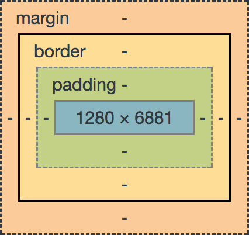

# CSS(Cascading Style Sheets)

* css 적용하는 3가지 방법
 1. 인라인 : html에서 style. **embed 보다 우선순위(가장 많은 노력)**
 2. embed : 내부참조(embed) haed 태그 내에 style 태그
    * 선택자(Selector) : 특정 요소들을 선택하여 스타일을 적용할 수 있게 해주는 요소. 태그 > 클래스 > 아이디
      * 태그 선택자 : h1 {color: red;}
      * 클래스 선택자 : **!important는 인라인보다 우선. 같은 important는 마지막 선언이 우선. 하지만 사용 주의해야!** `.클래스명`
      * 아이디 선택자 : `#아이디명` 
    * 예시
      * [01_css.html](01_css.html)
      * [01_style.css](01_style.css)
 3. 외부에서 css 링크 : 이 방법이 가장 좋음.
    * 그룹 선택자 
    * 인접 선택자 : 인접되어 있는 것 선택하는 방법
    * 자식 선택자 : 바로 밑에 있어야.
    * 후손 선택자 : 밑에만 있으면 됨
    * 기타..
    * 예시
      * [02_css.html](02_css.html)
      * [02_style.css](02_style.css)

* 단위

  * px : 픽셀. 환경에 따라 다름.
  * % : 백분율
  * rem : root em. root 요소(html)의 배수
  * em : 상위 요소의 배수
  * vw : vertical width. 뷰포인트의 너비값의 1/100.
  * vh : vertical height. 뷰포인트 높이값의 1/100.
  * vmin : 너비값, 높이값 중 작은 것의 1/100.
  * vmax : 너비값, 높이값 중 큰 것의 1/100.
  * 예시
    * [03_css.html](03_css.html)
    * [03_style.css](03_style.css)

* Box model

  

  * margin : `margin-top`, `margind-right` 등.
    * margin-shorthand의 margin 값 1개(상하좌우), 2개(상하, 좌우), 3개(상, 좌우, 하), 4개(상, 좌, 하, 우)를 이용해 여백 표현 가능.
  * border : `border`, `border-width` 등.
  * padding : `padding-top`, `padding-right` 등.
  * content : 실제 내용. `width`, `height` 등 속성 사용.
  * 예시
    * [04_css.html](04_css.html)
    * [04_style.css](04_style.css)

* display 속성

  * block 
    * 새로운 라인에서 시작
    * 너비가 정해지면 나머지를 margin으로 알아서 해줌.
    * 왼쪽(`margin-right:auot;`), 오른쪽, 가운데 정렬
    * `h1-h6`, `p`, `div`, `form`, `table`, `ol`, `ul`, `li`, `hr` 태그들은 `display:block`을 가지고 있다.
    * cf. text 정렬 : `text-align: center;`
  * inline
    * 너비를 가질 수 없음. 컨텐츠 영역만큼 영역을 가지고 있음.
    * 새로운 라인에서 시작하지 않음
    * `input`, `span`(가장 기본적인 인라인의 요소), `a`, `img` 등의 태그
    * cf. `span` vs `div`
  * block, inline 예시
    * [05_css.html](05_css.html)
    * [05_style.css](05_style.css)
  * inline-block
  * None : 요소를 화면에 표시하지 않음(공간조차 사라짐)
* visibility

  * visible
  * hidden 
  * cf. `display: none` vs `visibility: hidden` : **display는 공간조차 사라진다. hidden은 보이진 않지만 공간이 있다.**
* 변화할 수 있는 display 속성
  * `div`가 무조건 block이 아님.
  * inline은 내용없이 존재할 수 없다. ( width, height 적용x)
  * inline-block은 block속성 (width, height)와 inline 속성(우측 margine이 사라짐)을 가지고 있다.
* none & hidden, display 예시
  * [06_display_2.html](06_display_2.html)
  * [06_style.css](06_style.css)


* position
  1. static (기본위치) : 원래 있어야 할 위치
  2. relative (상대위치)
     * 기본 위치를 기준으로.
     * 좌표 프로퍼티만큼 이동
  3. absolute (절대위치)
     * static을 제외한 가장 가까이 있는 조상 요소를 기준으로.
     * 좌표 프로퍼티만큼 이동
     * **원래 있어야 할 위치가 유지되지 않음.**
  4. fixed (고정위치)
     
     * 화면 기준으로.
     
   * 예시
      * [07_position.html](07_position.html)
      * [07_style.css](07_style.css)
      
      
  
* float

  * 흘러다니는 요소
  * inline처럼 생겼지만 inline이 아님.
  * 예시
    * [08_float.html](08_float.html)
    * [08_style.css](08_style.css)

### 배경이미지


### font

기본적으로 16px

* font-size
* font-family : 'Times New roman', Times, serif
  * 띄어쓰기만 ''.
  * 첫번째 폰트부터 없으면 다음 폰트.
* font-weight : bolder, lighter, 100  => 굵기

* font-style: italic => 모양

  * https://fonts.google.com/?subset=korean

  * 원하는 폰트 + 담기

  * 링크 복사 후 html 문서에 붙여넣기

    ```html
    <head>
        <link href="https://fonts.googleapis.com/css?family=Kirang+Haerang|Yeon+Sung&display=swap" rel="stylesheet">
    </head>
    ```

## 부트스트랩

구글 웹스토어 > wappalyzer : 웹사이트 분석 프로그램

