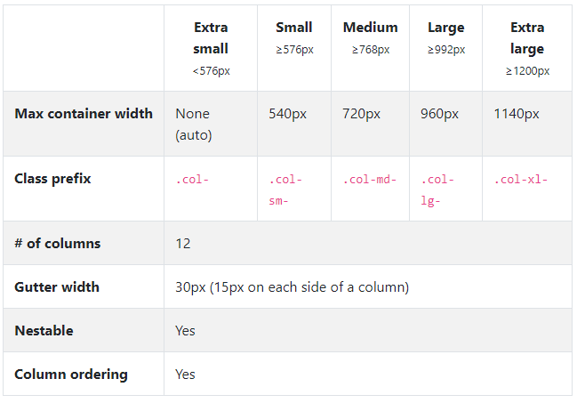

# bootstrap

## CDN?

* Content Delivery(Distribution Network.
* 컨텐츠(CSS, JS, Image, Text 등)를 효율적으로 전달하기 위해 여러 노드에 가진 네트워크에 데이터를 제공하는 시스템.
* 개별 end-user의 가까운 서버 통해 빠르게 전달(지리적 이점)
* 외부 서버 활용함으로써 본인 서버 부하 적어짐.
* 빠르게 로딩 가능.


https://getbootstrap.com/docs/4.3/utilities/borders/

## 1. Spacing

* `.m-0`?
  * margin: 0;
* `mx-0`? **시험**
  * x축을 바꿈.
  * margin-left: 0;
  * margin-right: 0;
* `.py-0`
* `.mt-1`
  * margin-top: 0.25rem?? 
  * 브라우저 기본 rem은 16px
  * 4px
* 0~5까지
  * 음수는 margin만 가능

## 2. Color

* 배경색
  * primary, secondary, success, ... 예쁜 색
  * `bg-primary` : background-color: primary;

* 텍스트색
* 여기저기에 써보자!
  * `btn-success`

## 3. border

```html
<head>
  <style>
    div {
      height: 100px;
    }
  </style>
</head>
```

이것을 해주는 이유는 div는 높이를 가질 수 없기 때문임.

## 4. Display

d-none

* `.d-sm-none .d-md-block` :모바일 크기부터 보여주고 태블릿 크기에선 block

## 5. Position

## 6. Text

VS Code beautify


## Grid system

**flex** iE11+

그리드 시스템: 디자인적 요소. 디자인 할 때 그리드 시스템을 레이아웃에 활용하면 격자무늬로 칸을 나눠 배분할 수 있다. 원하는대로 배치시킬 수 있음.

flex container 선언

그안에 들어가는 것  item

* 어떻게 나눌지(container), 어떻게 채울지(col), 어떻게 (flex)

* 컬럼 수 : 12개(약수가 많기 때문.)

* `.col` : 몇 컬럼을 잡을 것인지.

* Container

  * [08_grid.html](08_grid.html)

  * 컨테이너 밖: 기본적으로 너비 100%.

  * 컨테이너 안: 창 넓이에 따라 마진 달라짐.

  * `container-fluid` : 전체 너비 다 가지고 패딩값만 부여. 

  * 디폴트 그리드 시스템 쓰기 위해서는 컨테이너로 둘러싸고 사용할 것.

  * `<div class="row">`반드시 로우가 필요함.

    ```html
    <div class="container">
      <div class="row">
      <!-- 총 12칸을 3등분, 즉 4칸씩 -->
      <div class="col-4">
        <div class="bg-primary text-center text-white">1/3</div>
      </div>
      <div class="col-4">
        <div class="bg-primary text-center text-white">1/3</div>
      </div>
      <div class="col-4">
        <div class="bg-primary text-center text-white">1/3</div>
      </div>
    </div> 
    ```

  * `div.row>div.col-4.bg-primary`: 편리한 명령어

  * 12가 넘으면 다음 줄로 넘어가버림 **주의**

* offset

  * [08_grid.html](08_grid.html)
  * 칸띄우기
  * 마치 오른쪽정렬, 가운데 정렬한듯이 배치 가능

* 반응형 (breakpoint)

  * [08_grid.html](08_grid.html)
  * 그리드옵션 **무조건 시험에 나오는 문제**

  

  * `col-6 col-sm-3`:  창이 576px보다 작을 때 `.col`, 클 때 `.col-sm-`.
  * [문서 한번씩 읽어보기](https://getbootstrap.com/docs/4.3/layout/grid/)
    * Mix and match
    * Order classes : 순서 뒤바꾸고 싶을 때 자유자재로 바꿀 수 있음.
    * Vertical alignment: 수직 정렬

* flex: 개별 지정을 가능케 해줌.

  * [09_flex.html](09_flex.html)
  * [flex.css](flex.css)
    * `row`의 `display: flex`
    * `container`에 `display: flex;`를 하게 되면 인라인처럼 바뀜.
    * flex 선언
      * flex container: 감싸고 있는 부모 요소
      * flex items: 구성하고 있는 아이템 요소
    * flex 방향설정 (default: row)
  * [10_flex_align.html](10_flex_align.html)
    * `flex-grow`: 남은 여백을 나눠가짐. (default: 0)
    * `justify-content`: x축 정렬. 가로정렬
      * flex-start(왼쪽), center(가운데), flex-end(오른쪽)
      * space-between(사이에 균등하게 여백)
      * space-around(item 좌우 여백 동일)
      * space-evenly(item 외곽 여백 동일)
      * 세로 정렬일 때 가로 양끝 없이 사이 띄우기.`align-content`:space-between
    * `flex-direction`에 따라 `justify-content` 방향 바뀐다.
      * row-reverse, column-reverse와 함께 쓰일 때 주의(기준점 찾기)
    * `align-items`: y축정렬
      * flex-start, center, flex-end
      * baseline: 폰트 바꿔서 확인!
    * 시작점 -> 끝점 => 가로정렬. justify-content
    * 시작점 -> 수직 => 세로정렬. align-items

  * [11_flex_item.html](11_flex_item.html)
    * `align-self`: 개별 아이템의 배치 변경이 가능함.
    * `order`: 순서변경, 기본 order는 모두 0.
  * [게구리 게임 flex](https://flexboxfroggy.com/#ko)

* 그리드가 아닌 flex만으로 배치 바꿀 수 있다.
  * [12_flex_bootstrap.html](12_flex_bootstrap.html)
    * `justify-content`, `item align`은 container에 부여하는 것.
  * [12_flex_layout.html](12_flex_layout.html)
    * block에서는 margin-top: quto 불가능.
* https://daneden.github.io/animate.css/